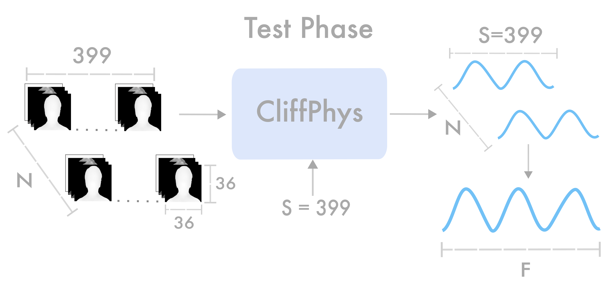
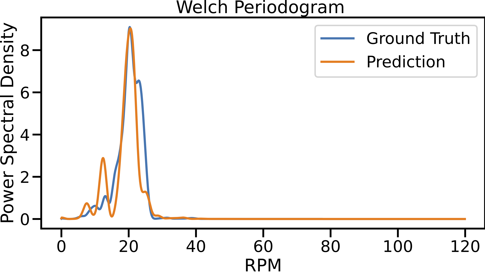
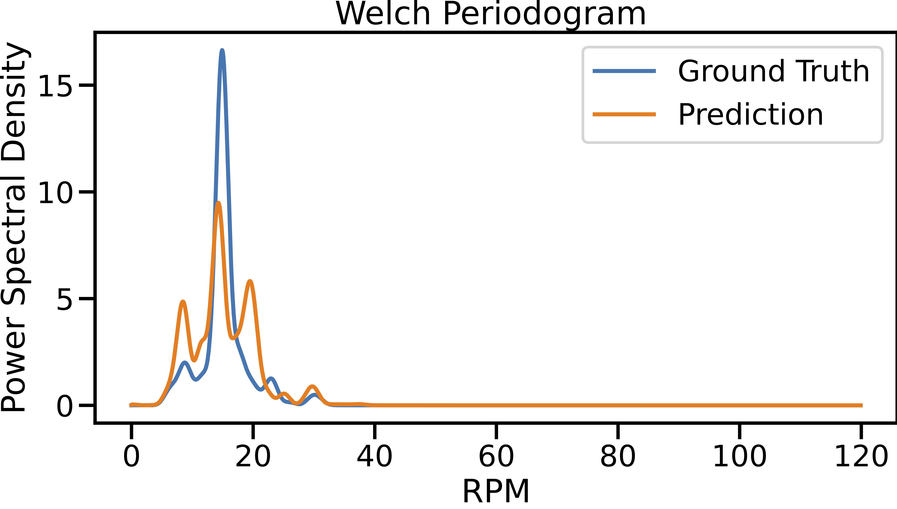
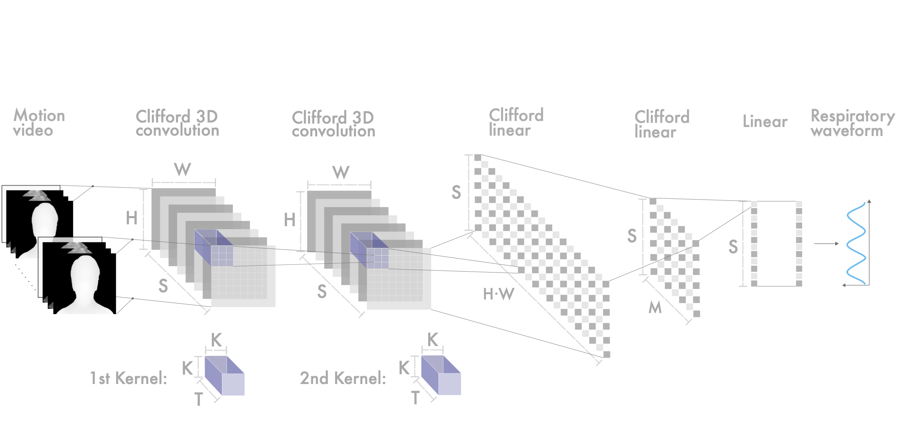

# CliffPhys: Camera-based Respiratory Measurement using Clifford Neural Networks


Demo code for the submitted paper 'CliffPhys: Camera-based Respiratory Measurement using Clifford Neural Networks' (Paper ID #11393)

## Description
This repository contains demo code for extracting respiratory waveforms from videos using the **`CliffPhys`** family of methods. The provided methods utilize Clifford Neural Networks for accurate respiratory measurement from camera feeds.

<!-- 
  -->

## Getting Started

### Installation
Download the repository, then:
   
1. Move to the CliffPhys directory and install the dependencies:
   ```sh
   conda env create -f environment.yml

2. Activate the CliffPhys conda environment:
   ```sh
   conda activate CliffPhys

## Basic Usage (quick evaluation framework)
The evaluation framework *run_all.py*, for the **`CliffPhys`** model family, involves three main actions:
1. In the CliffPhys directory, create the results folder:
   ```sh
   mkdir estimates
   ```
2. *Action 0*: extracts respiratory waveforms from videos.
   ```sh
   python run_all.py -a 0 -d './estimates/' -t 'XYZ' -m 'CliffPhys30_d'
   ```

   If the *video_type* is *'XYZ'*, it extracts waveforms from two *'XYZ'* (monocular depth estimation + 2D vertical and horizontal optical flow) video examples, stored as numpy arrays in *'./data/bp4d_XYZ/'*, using the specified **`CliffPhys`** method. If the *video_type* is *'RGB'*, it first converts each video, in the *'./data/bp4d/'* (empty) directory, to an *'XYZ'* video and then extracts the corresponding predicted respiratory waveform. You need to install an Optical Flow extraction method (e.g. ptlflow's raft_small) and a Monocular Depth Estimation mathod (e.g. midas) in order to perform the extraction directly from an 'RGB' video.

3. *Action 1*: extracts the Respiratory Per Minute (RPM) of the predicted respiratory waveforms.
   ```sh
   python run_all.py -a 1 -d './estimates/' 

4. *Action 1*: print error metrics between the predicted RPM and the Ground Truth (GT) RPM.
   ```sh
   python run_all.py -a 2 -d './estimates/'

Default action is *Action 0*, default directory is *'./estimates/'*, videotype is *'XYZ'* or *'RGB'* (default to *'XYZ'*), methods are listed in the table below (default to *'CliffPhys30_d'*).

Running *Action 0* and *Action 1* with default arguments leads to the following PSDs and Time Signals plots (stored in *'./estimates/'*) for subjects *M025_T8* and *F052_T8* respectively:




Running *Action 2*, the model's performance is presented in the table below. The table includes various performance metrics such as Root Mean Squared Error (RMSE), Mean Absolute Error (MAE), Mean Absolute Percentage Error (MAPE), Pearson Correlation Coefficient (PCC), and Lin's Concordance Correlation Coefficient (CCC):


|   Method  | RMSE | MAE  | MAPE | PCC | CCC  |
|-----------|------|------|------|-----|------|
| cliffphys | 0.47 | 0.45 | 2.53 | 1.00| 0.99 |

## Basic Usage (simple prediction)
The following code can be used to predict the respiratory waveform from a XYZ video stored at the provided path:
```python
import os
import numpy as np
from methods import CliffPhys

# Data definition
d = {}
d['video_path'] = './data/bp4d_XYZ/M025_T8/'
d['subject'] = 'M025_T8'
d['xyz_tensor'] = np.load(os.path.join(d['video_path'], 'RGB_XYZ_tensor.npy'))
d['fps'] = 20

# Initialization and prediction using the CliffPhys methods ('CliffPhys30_d' model with training choice 'PT-scamps_XYZ_FT-cohface_XYZ')
method = CliffPhys('CliffPhys30_d', 'PT-scamps_XYZ_FT-cohface_XYZ')
prediction = method.process(d)
```

To predict the respiratory waveform directly from an RGB video it is mandatory to run the following pre-processing step:
```python
import os
import numpy as np
import utils
d = {}
d['video_path'] = # Path to video file
d['subject'] = # Name of the directory containing the subject's video
d['fps'] = 25
extract_OF_type = 'raft_small'
extract_depth_type = 'midas'
data_dir = './data/bp4d/'
paths = {
		'XYZ': os.path.join(data_dir, d['subject']),
		'gt': os.path.join(data_dir, d['subject'])
}
utils.get_XYZ_tensor(d['video_path'], d['fps'],extract_OF_type, extract_depth_type, paths)
```
Then run the simple prediction script to extract the respiratory waveform prediction. XYZ videos are extracted using an Optical Flow extraction method (e.g. ptlflow's raft_small) and a Monocular Depth Estimation mathod (e.g. midas). You need to install the respective packages in order to run the *get_XYZ_tensor* function.


## Models



Methods with the *_d* suffix process the 2D vertical and horizontal optical flow projections, along with the provided monocular depth estimation additional information. Methods without *_d* process only the 2D optical flow input.
| Method             | Description                            | File                                                                  |
|--------------------|----------------------------------------|-----------------------------------------------------------------------|
| CliffPhys30_d      | Model based on the Clifford Algebra of signature (3,0). It takes as input the Monocular Depth Estimation, along with the horizontal and vertical Optical Flow vectors.| ./weights/CliffPhys30_d/PT-scamps_XYZ_FT-cohface_XYZ/Best_epoch.pth   |
| CliffPhys30        | Model based on the Clifford Algebra of signature (3,0). It processes only the horizontal and vertical Optical Flow vector. | ./weights/CliffPhys30/PT-scamps_XYZ_FT-cohface_XYZ/Best_epoch.pth     |
| CliffPhys02_d      | Model based on the Clifford Algebra of signature (0,2). It takes as input the Monocular Depth Estimation, along with the horizontal and vertical Optical Flow vectors.              | ./weights/CliffPhys02_d/PT-scamps_XYZ_FT-cohface_XYZ/Best_epoch.pth   |
| CliffPhys02        | Model based on the Clifford Algebra of signature (0,2). It processes only the horizontal and vertical Optical Flow vector. | ./weights/CliffPhys30/PT-scamps_XYZ_FT-cohface_XYZ/Best_epoch.pth              | ./weights/CliffPhys02/PT-scamps_XYZ_FT-cohface_XYZ/Best_epoch.pth     |
| CliffPhys03_d      | Model based on the Clifford Algebra of signature (0,3). It takes as input the Monocular Depth Estimation, along with the horizontal and vertical Optical Flow vectors.         | ./weights/CliffPhys03_d/PT-scamps_XYZ_FT-cohface_XYZ/Best_epoch.pth   |
| CliffPhys03        | Model based on the Clifford Algebra of signature (0,3). It processes only the horizontal and vertical Optical Flow vector.             | ./weights/CliffPhys03/PT-scamps_XYZ_FT-cohface_XYZ/Best_epoch.pth     |
| CliffPhys20_d      | Model based on the Clifford Algebra of signature (2,0). It takes as input the Monocular Depth Estimation, along with the horizontal and vertical Optical Flow vectors.            | ./weights/CliffPhys20_d/PT-scamps_XYZ_FT-cohface_XYZ/Best_epoch.pth   |
| CliffPhys20        | Model based on the Clifford Algebra of signature (2,0). It processes only the horizontal and vertical Optical Flow vector.               | ./weights/CliffPhys20_d/PT-scamps_XYZ_FT-cohface_XYZ/Best_epoch.pth   |

## License
This project is licensed under the GNU General Public License v3.0 - see the [LICENSE](LICENSE) file for details.
